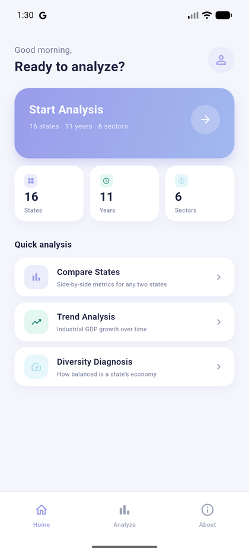
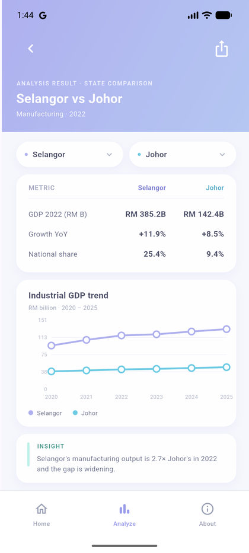
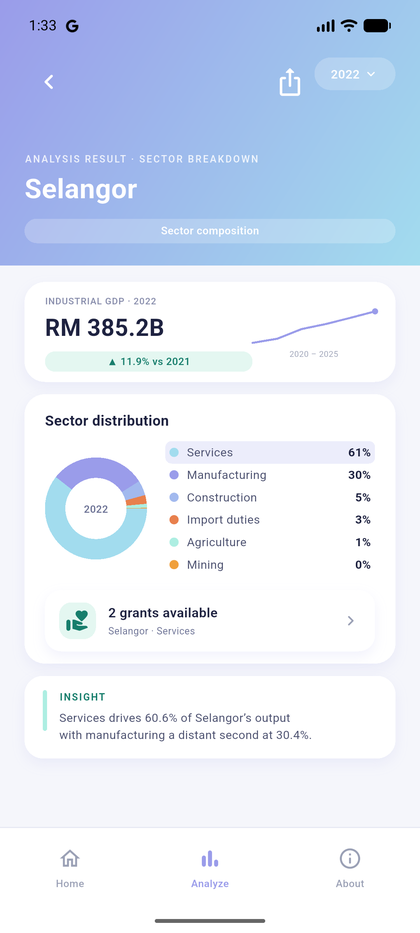
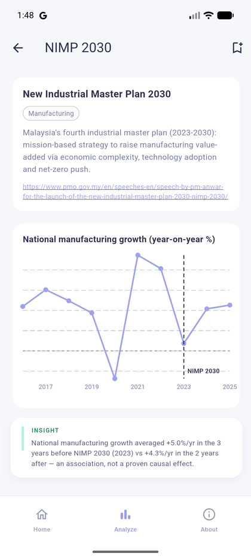
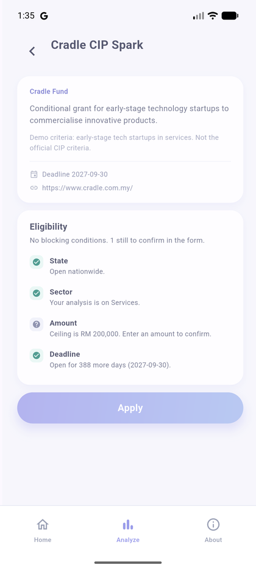

# GDP Analyzer

Malaysian state GDP by economic sector, on a phone.

Coursework for **BMIT2073 Mobile Application Development**, aligned to
**SDG 9 — Industry, Innovation and Infrastructure**. Every figure in the app
is computed from the official DOSM dataset published on data.gov.my.

<table>
<tr>
<td align="center"><br><sub>Home</sub></td>
<td align="center"><br><sub>State Comparison</sub></td>
<td align="center"><br><sub>Sector Breakdown</sub></td>
<td align="center"><br><sub>Policy Impact</sub></td>
<td align="center"><br><sub>Grant Detail</sub></td>
</tr>
</table>

## What it does

Pick an analysis mode, the states, a sector and a year. Every result is one
chart plus one plain sentence.

| Mode | The question it answers |
| --- | --- |
| State Comparison | How do two states compare in one sector, and is the gap widening? |
| Sector Breakdown | What is a state's economy actually made of? |
| Time Trend | How has one sector in one state moved over eleven years? |
| Diversity Diagnosis | Which states lean too heavily on a single sector? |
| Policy Impact | What happened to sector growth before and after a policy took effect? |

**Grant module.** An analysis points at a sector, the sector lists the grants
open to it, and the grant explains which of its conditions the current
selection meets. An administrator publishes a grant, a user applies, and the
administrator approves or rejects it — all against the same tables.

**Accounts.** Supabase Auth backs sign-up and sign-in. A `role` column on the
profile row decides who reaches the administration screens, and row level
security enforces it on the server rather than by hiding buttons.

## Data

- **Source:** [data.gov.my](https://data.gov.my) — dataset
  `gdp_state_real_supply` (DOSM, *Annual Real GDP by State & Economic Sector*).
- **Units:** RM million at constant 2015 prices, 2015–2025, 16 states and
  federal territories plus offshore (Supra), across 6 economic sectors.
- **Offline:** the dataset is fetched at startup and falls back to a snapshot
  bundled in `assets/`, so every screen works without a connection.
- **A known gap:** W.P. Putrajaya only enters the dataset in 2023. Earlier
  years therefore score 15 of 16 states, and the Diversity screen says so
  instead of quietly ranking fewer.

Policy analysis reports an **association** between a policy year and later
growth. It is not a causal claim, and the app says so on screen.

## Disclaimer

This is a coursework prototype. The grant listings and the application form
are a demonstration — **this app is not an official application channel**, and
nothing submitted through it reaches any agency or fund. Grant conditions are
this app's own demo criteria, not the official ones; each grant links to its
real source.

## Running it

```bash
flutter pub get
flutter run
```

Dart SDK `^3.12.2`. Supabase is already configured in `lib/main.dart` with the
project's publishable key — that key is meant to be shipped in a client, and
every table is protected by row level security.

Release build:

```bash
flutter build apk --release
```

## Project layout

```
lib/
├── data/        repositories, the data.gov.my client, metrics, CSV export
├── models/      the data contracts shared across the app
├── pages/       one file per screen
├── state/       AppState, the single ChangeNotifier behind every screen
├── ui/          design tokens
└── widgets/     shared components
assets/          bundled GDP snapshot, policy catalogue, grant seed data
test/            unit and widget tests
```

## Team

| Member | GitHub | Modules | Network call | Data processing |
| --- | --- | --- | --- | --- |
| Lam Yong Zhe | [@ketoru210](https://github.com/ketoru210) | Data layer, models, app state, shared widgets, Analysis Filter, Diversity Diagnosis | data.gov.my catalogue GET with snapshot fallback | Joining the absolute and growth series; HHI concentration; national totals and shares |
| Lai Kang Yong | [@kangyongno2](https://github.com/kangyongno2) | Supabase project (tables, RLS, Auth), cloud user repository, Log in / Register / Profile, Publish Grant, Pending Approvals, Home, State Comparison | Supabase Auth; `profiles` read and write; `grants` insert; `applications` update | Merging local and cloud favourites; resolving a session to a role |
| Fong Qin Wen | [@qw610](https://github.com/qw610) | Grant repository, Grant Browse / Detail / My Applications, eligibility rules, Sector Breakdown and its drill-down | `grants` select; `applications` insert and select | Matching a grant against the analysis context and explaining each rule |
| Lian Teck Wei | [@Lys4c](https://github.com/Lys4c) | Versioned policy catalogue, policy metrics, CSV export, Time Trend, Policy Impact, About | Policy catalogue GET with a version check and bundled fallback | Average growth in the windows before and after a policy; reshaping results into a flat table |

## Quality

```bash
flutter analyze   # 0 issues
flutter test      # 51 passing
```
